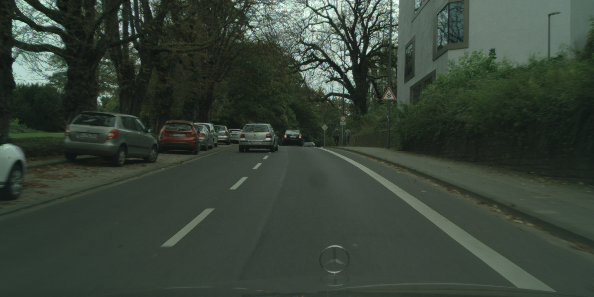
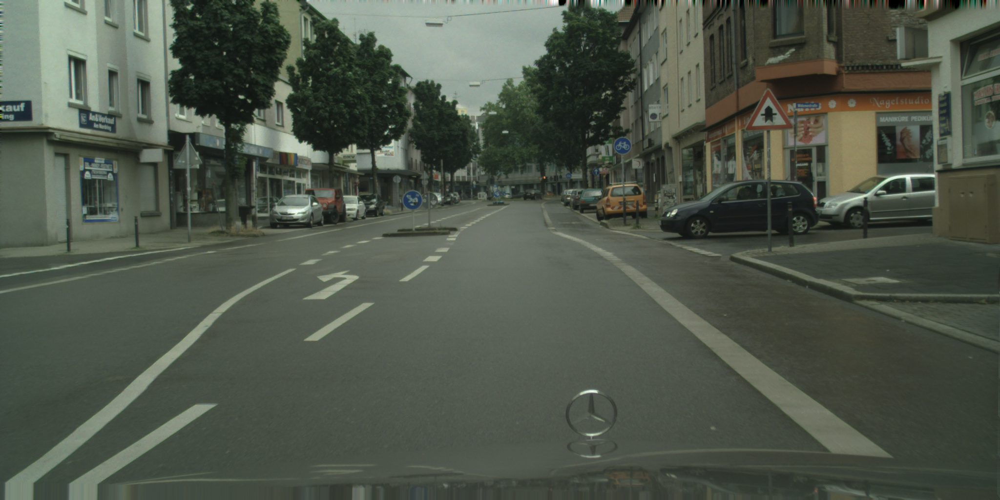
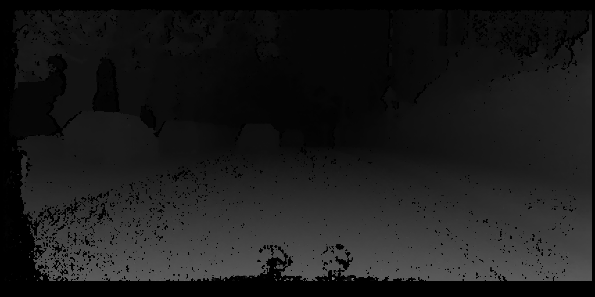
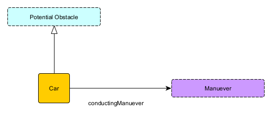
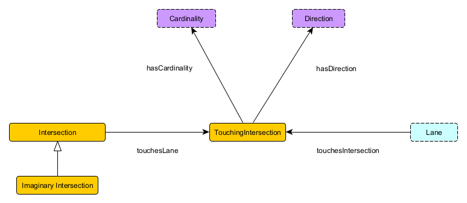
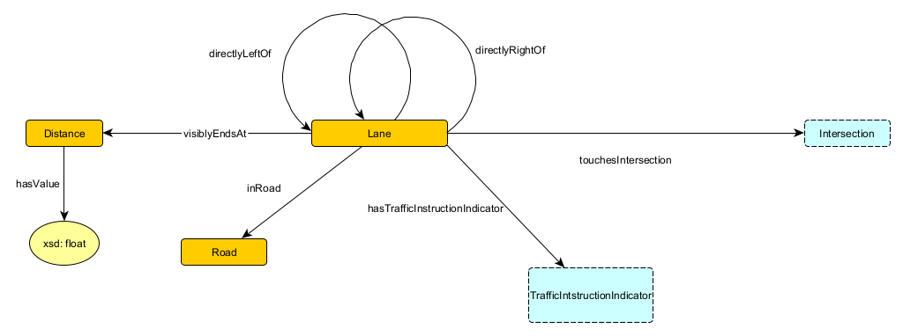
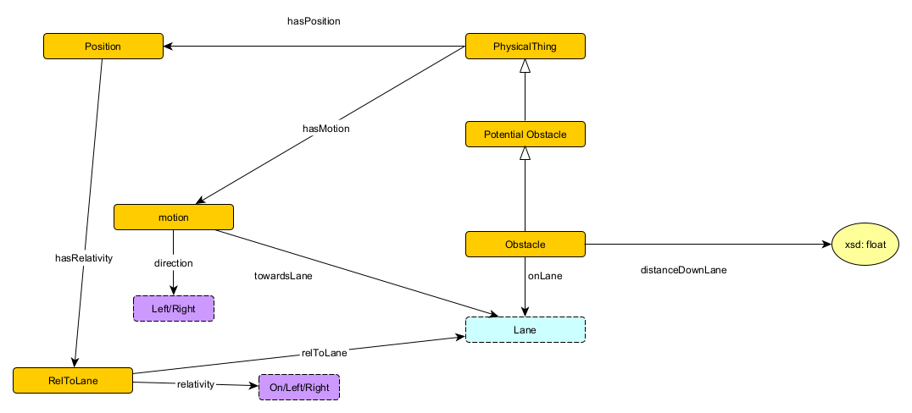
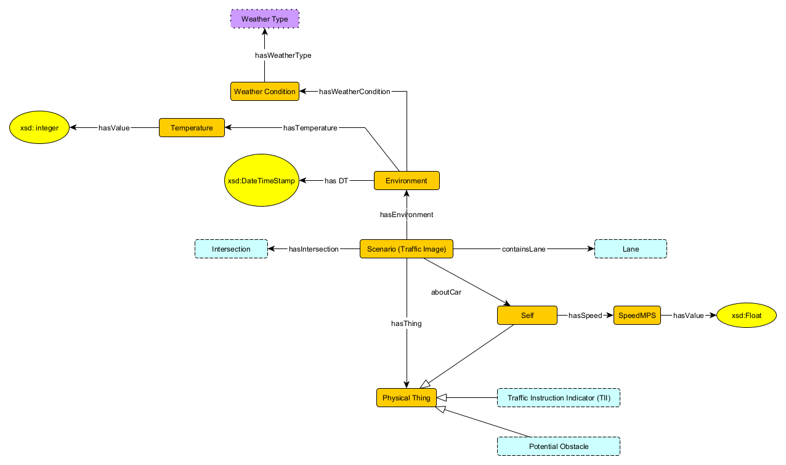
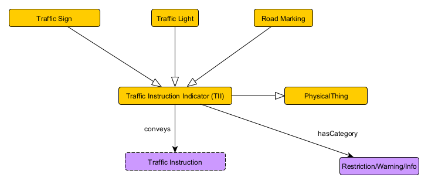
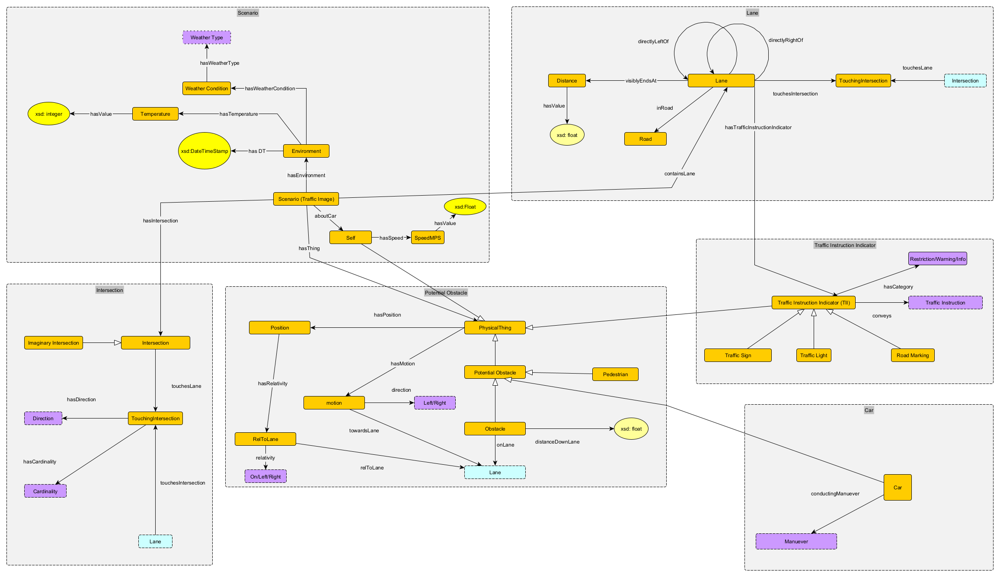

# The Driving Project
**Authors:** Jehan Fernando, Chris Menart, Alex Moore

## Use Case Scenario

### Narrative 

Self-driving cars often utilize machine learning techniques to identify the presence of cars, road signs, drivable lanes, and other relevant objects and obstacles. However, this identification is not the same as knowing what driving actions are allowable. The vehicle must perform additional processing to understand what maneuvers, such as forward movement, lane switching, and turning, are safe and legal at any given time. This could potentially be done with reinforcement learning, but this may be opaque, brittle, and resistant to the inclusion or easy alteration of policies and business (or legal) rules. A semantic technology such as a knowledge graph, alternatively, could reason over the vehicle's knowledge about its surroundings to determine appropriate actions.

The goal of this system is to use semantic and spatial reasoning to understand moment-by-moment traffic scenarios, turning the identificaiton of objects into situational awareness. We aim to create a knowledge graph which could support hand-coded determination of what maneuvers are legal and safe for a self-driving car to perform. This knowledge graph will be populated with knowledge obtained from the analysis of optical and/or lidar data, the typical data upon which self-driving systems are built. The entities and relationships it models will be those that are relevant for training, analyzing, or operating a self-driving car determining what maneuvers to make while driving among traffic and other obstacles.

For example, a car approaching an intersection may have several options in the abstract: going straight, turning right or left, coming to a stop, or even making a U-turn. However, only some of these options will be allowable by the rules of the road at any given time. A stop sign or red traffic light means that a stop is required before proceeding through an intersection. If the car's route requires turning left, the car must be in the appropriate lane--usually a lane further to the left. Pedestrians crossing the intersection from any number of direcitons may render any number of these maneuvers temporarily unsafe.

 

  
  
<br><br><br><br><br><br><br><br><br>
   
---

_Above are shown example scenes are system might reason over. Traffic signs are a useful source of information about what actions are allowable on the road! Left: If a sign indicates that we are on a bridge which freezes over easily, we may wish to slow down depending on our knowledge of the current temperature orseason. Right: If a sign indicates that we have the right of way, we know that we do not have to stop for vehicles proceeding down an intersecting road._ 

---

In addition to traffic signs, our calculations can involve three-dimensional spatial reasoning. The ego-distance of cars and other obstacles affects our available actions, as does whether objects are in front of or behind each other, or on drivable surfaces such as they road. 

 

<br>
<br>


_Three-dimensional locations can be computed from the data in the machine-learning databases from which we are mining our example situations. The "disparity image" here encodes depth information computed from binocular cameras. (This depth map encodes distances for the bridge image directly above.)_
<br><br><br><br><br>

This ontology was created as coursework for CS7810 at Wright State University.

### Competency Questions
* Does the car need to stop or slow down?
* Is there an object moving into the lane?
* How many lanes are in the current road?
* Is this road a one-way street?
* Is this railroad currently closed for train access?
* What is the average number of cars traveling on the road (based on data in all scenarios)?
* How many cars are in this scenario?
* Which scenarios can the car merge to the right/left?
* Which scenarios have temperatures above 20 degrees Celcius?
* Which scenarios include restrictions based on temperature?
* What is the current speed of the car?

### Integrated Datasets

* Cityscapes (https://www.cityscapes-dataset.com/)
Cityscapes is one of the oldest and most mature datasets for self-driving car sensor data. Collected in Germany and first, published in 2016, it consists of binocular optical camera data captured from dashboard cameras on drives through several dozen German cities. The objects in those drives--especially vehicles and pedestrians--were annotated in every 30th frame of selected video segments, with varying levels of detail depending on the objects. It was expanded over time with additional annotations, such as 3d vehicle annotations, more detailed person annotations, and annotations for a limited amount of data collected in rainy weather, among others. More information can be found in [the Cityscapes technical paper](https://arxiv.org/pdf/1604.01685v2.pdf), in addition to the website.

* Road Signs in Germancy (https://routetogermany.com/drivingingermany/road-signs)
It transpires that Germany, in shocking congruence with all knowns stereotypes about Germans, has a large number of unique traffic signs with information-laden iconography. This website is a catalogue of many of the most used signs, along with explanations of their meaning. While it was not directly scraped using code, it informed the labeling process below.

* Cityscapes manual additions by team (https://github.com/CJMenart/MetadataRepresentationProject/blob/main/Data%20Wrangling/CS7810_manual_entry.txt)
Over the course of the middle week's of the Self-Driving Ontology's development, schemas developed in unexpected directions. Detailed representations of abstract traffic entities such as Intersections had to be developed in order to answer motivating questions about the flow of traffic and the legality of various driving maneuevers. As much of this abstraction is not annotated in our other data, some additional data was created manually, adding necessary information that glues together many of the physical objects in Cityscapes.

### References
* Cordts et al., "The Cityscapes Dataset for Semantic Urban Scene Understanding". *CVPR 2016*. 10.1109/CVPR.2016.350


## Modules
<!-- There should be one module section per module (essentially per key-notion) -->
### Car
**Source Data:** Cityscapes Dataset

#### Description
Cars are of obvious interest to a system concerned with traffic and roads. One of the most obvious pieces of information to track about cars would be make, model, or other forms of classification. But after debate, we chose not to include these details, resulting in the lightest schema in the ontology. What we care about with respect to vehicles is rather where they are (which is covered by the PotentialObstacle schema) and where they are going.

One of the core imagined functions of our KG is reasoning over what meanuevers are possible for a self-driving vehicle to perform, and which ones it is actually allowed to do. Here, these will be represented by a controlled vocabulary, which we can iterate over and "check" against the existence of things which might make them disallowed. This same controlled vocabulary can be used to track the actions currently being executed by our neighbors.

Theoretically, these could use the Events pattern from MODL, but using ParticipantRoles or SpatioTemporalExtents would significantly increase the complexity of our ontolgoy and does not seem to fit directly into our use cases.



#### Axioms
* `Car SubClassOf conductingManeuver exactly one Maneuver.`  
	"A Car is always conducting exactly one Maneuver."

#### Remarks
* Any remarks re: usage

### Intersection
**Source Pattern:** Collection  
**Source Data:** Team annotations to the Cityscapes Dataset (found under "Data Wrangling")

#### Description
Intersection was the latest addition to the ontology. At first, it was a property by which Lanes pointed to each other, a way of determining which locations in a Scenario could be reached from one another. However, we quickly realized that Intersection needed to be reified so that more details about an intersection could be tracked--to begin with, the intersection of an arbitrary number of lanes of traffic at once. 

An Intersection is a collection of lanes which tracks the direction of its attendant lanes--which are incoming or outgoing--and also their cardinality, i.e. what order the roads at an intersection can be found by counting clockwise or counterclockwise around it. We closely considered both the bag and ordered list patterns from MODL to represent this strucutre, but neither felt perfectly appropriate. There are several intricacies specific to traffic intersection, such as the additional pieces of information noted above. Lanes can also touch more than one intersection (in fact, up to two).



#### Axioms
* `TouchingIntersection SubClassOf hasDirection exactly 1 Direction`  
	"A TouchingIntersection has exactly one Direction"
* `TouchingIntersection SubClassOf hasCardinality exactly 1 Cardinality`  
	"A TouchingIntersection has exactly one Lane"
* `TouchingIntersection SubClassOf inverse touchesIntersection exactly 1 Lane`  
	"A TouchingIntersection has exactly one Cardinality"
* `TouchingIntersection SubClassOf inverse touchesLane exactly 1 Intersection`  
	"A TouchingIntersection has exactly one Intersection"
* `Scenario SubClassOf hasIntersection exactly one ImaginaryIntersection`  
	"A Scenario has exacty one Intersection which is an ImaginaryIntersection."

#### Remarks
* Any remarks re: usage

### Lane
**Source Data:** Team annotations to the Cityscapes Dataset (found under "Data Wrangling")

#### Description
The "Lane" class represents a drivable segment of road that vehicles may proceed along. A single Lane never crosses an intersection; all parts of the road on the far side of an intersection count as a new lane. You can picture Intersections as nodes on a graph, and Lanes as edges connecting them. 

In fact, all Lanes have a direction relative to at least one Intersection. This is how their direction is specified. If an intersection is not within visual range, in a given scenario, an assumption is made that the Lane is emanating from an Intersection some distance behind the Self vehicle, called the "Imaginary Intersection". 

Another natural unit of consideration for traffic-related reasoning is the "Road". In this ontology, Lanes are the most-used fundamental unit, but Roads do exist, as a collection of Lanes. In fact, a Road is a doubly-linked list of lanes. Lanes use the "directlyLeftOf" and "directlyRightOf" to represent lanes that are adjacent to each other with no other surfaces in between. This is important for determining which lanes can be traversed by cutting across a road, whether by a car performing a lane change or a pedestrian walking through a crossing. Most of the time, these transitive relationships are enough for reasoning about Lanes. Road is technically made redundant by them, but retained not only because it may have future use but for making some rules and axioms considerably more conscise. Determining whether Lanes are in the same Road is simpler to express than checking whether two Lanes are rechable via a chain of leftOf and rightOf relationships.




#### Axioms
* `Lane SubClassOf directLeftOf max 1 Lane`  
	"A Lane can be directly left of at most one other Lane."
* `Lane SubClassOf directRightOf max 1 Lane`   
	"A Lane can be directly right of at most one other Lane."
* `directLeftOf inverse of directRightOf`  
	"If one Lane is directly left of another Lane, the second Lane is directly right of the first Lane."
* `Lane SubClassOf visiblyEndsAt max 1 Distance`   
	"A Lane has at most one Distance away where it visibly ends."
* `Road SubClassOf inverse inRoad min 1 Lane`   
	"A Road has at least one Lane"
* `Lane SubClassOf touchesIntersection min 1 TouchingIntersection`   
	"A Lane always touches at least one Intersection."
* `Lane SubClassOf touchesIntersection max 2 TouchingIntersection`  
	"A Lane always touches at most two Intersections."
* `Lane SubClassOf inRoad exactly 1 Road`  
	"Every Lane is in exactly one Road"
* `Distance SubClassOf hasValue some xsd:float`  
	"A Distance is represented by a floating-point value."

#### Remarks
* Any remarks re: usage

### Potential Obstacle
**Source Data:** Cityscapes Dataset

#### Description
Obstacles (or Potential Obstacles) represent things on the road that could block our driving (or things which could potentially end up on the road and do so). Theoretically an AgentRole could be used to represent Obstacles, but we concluded that this seemed to represent unnecessary overhead. 

What we need to know about an PotentialObstacle, and what is modeld, is its position, and, if relevant, its movement in space. Specifically, positions and movements are modeled in terms of which lanes an obstalce is obstructing and which lanes it might obstruct. The Obstacle class is used to mark PotentialObstacles which have become actual Obstacles, that is, occupy space in the road. 



#### Axioms
* `Position SubClassOf onLane max 2 Lane`   
	"A Position is always in at most 2 Lanes."
* `RelToLane SubClassOf relation exactly 1 Left/Right/On`   
	"The Position of a Potential Obstacle is either on a Lane, or to the right or left of a Lane."
* `Position SubClass hasRelativity exactly one RelToLane`  
* `RelToLane SubClass relToLane exactly one Lane`  
	"A Position is always given relative to a single Lane."
* `Motion SubClassOf direction exactly one Left/Right`  
	"A Motion is either to the left or right" (implicitly relative to the current Road.)
* `Motion SubClassOf towardsLane min 1 Lane`  
	"A Motion is always twoards at least one Lane."  
* `Obstacle SubClassOf relToLane o relativity some On  (This manchester is almost certainly wrong)`  
	"If the Position of a Potential Obstacle is not on any Lanes, that PotentialObstacle is not an Obstacle. Otherwise, it is."

#### Remarks
* Any remarks re: usage

### Scenario
**Source Data:** Cityscapes Dataset

#### Description
The scenario is the key notion that organizes all other information in this knowledge graph. Each scenario represents a given image of a traffic situation from the point-of-view of a vehicle in it. Using the traffic image, we may determine the lanes and intersections, as well as all potential obstacles and traffic instruction indicators that may affect our queries regarding potential available maneuevers. All Lanes, Intersections, and obstacles potential or realized belong to a particular Scenario. Additionally, each traffic image will reveal environmental information that may be relevant such as weather conditions, outside temperature, and time of day. These are tracked in the Ontology via several Stub patterns.



#### Axioms
* `Scenario SubClassOf hasEnviornment exactly 1 Environment`  
	"A Scenario has exactly one Environment"
* `Environment SubClassOf hasTemperature at most 1 Temperature`  
	"An Environment has up one Temperature."
* `Scenario SubClassOf containsLane min 1 Lane`  
	"A Scenario contains at least one Lane."
* `PhysicalThing SubClassOf inverse hasThing exactly 1 Scenario`  
	"Every PhysicalThing is within exactly one Scenario."
* `Scenario SubClassOf hasIntersection min 1 Intersection`  
	"A Scenario has at least one Intersection"
* `Scenario SubClassOf aboutCar exactly 1 Self`  
	"A Scenario has exactly one Self corresponding to the user's vehicle"
* `Temperature SubClassOf hasValue some xsd:integer`  
	"A Temperature is represented as an integer value"

#### Remarks
* Any remarks re: usage

### Traffic Instruction Indicator
**Source Data:** The Cityscapes dataset and team annotations to it (found under "Data Wrangling")

#### Description
This key notion encompasses any physical object on or near the road that provides information to drivers, such as road or traffic signs, road markings, and traffic lights. (We exclude lane lines from this definition). Each Traffic Instruction Indicator conveys a traffic instruction, represented using a controlled vocabulary, applied to a given lane or lanes. These instructions will provide information and/or restrictions to the possible maneuvers for the vehicle.



#### Axioms
* `Traffic Instruction Indicator (TII) SubClassOf conveys exactly 1 Traffic Instruction`  
	"Traffic Instruction Indicator (TII) conveys a single Traffic Instruction"
* `Traffic Instruction Indicator (TII) SubClassOf hasCategory exactly 1 Restriction/Warning/Info`  
	"Traffic Instruction Indicator (TII) has exactly one category of Restriction/Warning/Info"
* `Traffic Sign DisjointWith Traffic Light`  
        "A Traffic Sign is mutually exclusive from Traffic Light"
* `Traffic Light DisjointWith Road Marking`    
        "A Traffic Light is mutually exclusive from  Road Marking"
* `Traffic Sign DisjointWith Road Marking`  
	"Traffic Light, Road Marking, and Traffic Sign are all mutually exclusive types of Traffic Instruction Indicator (TII)."

#### Remarks
* Any remarks re: usage

## The Overall Knowledge Graph

### Namespaces
* project: <http://www.semanticweb.org/CS7810/Driving/Project#>

### Schema Diagram


### Axioms
* `T SubClassOf for-all hasValue only xsd:AnyValue`  
	"All stubs (using the hasValue relationship) point to an xsd primitive."

### Usage
* "In which scenarios does the car need to stop or slow down?"
```
SELECT DISTINCT ?scenario ?potentialObstacle ?self ?tii ?distance ?trafficLight
WHERE {
  {
  ?scenario a :Scenario .
  ?scenario :hasThing ?potentialObstacle .
  ?potentialObstacle :hasPosition ?position . 
  ?position :hasRelativity ?rel .
  ?rel :relativity :On-Left-Right.On .
  ?rel :relToLane ?lane .
  ?scenario :aboutCar ?self .
  ?self :hasPosition ?position1 . 
  ?position1 :hasRelativity ?rel1 .
  ?rel1 :relToLane ?lane .
  ?potentialObstacle :distanceDownLane ?distance .
  FILTER(?distance < 10) .
  }
  UNION
  {
  ?scenario a :Scenario .
  ?scenario :aboutCar ?self .
  ?self :hasPosition ?position1 . 
  ?position1 :hasRelativity ?rel1 .
  ?rel1 :relToLane ?lane .
  ?lane :hasTrafficInstructionIndicator ?tii .
  ?tii :conveys :TrafficInstruction.RedLight .
  ?tii :conveys ?trafficLight .
  }
} 
```    
* "In which scenarios is there an object moving into the lane?"
```
SELECT DISTINCT ?scenario ?potentialObstacle ?self 
WHERE {
  {
  ?scenario a :Scenario .
  ?scenario :hasThing ?potentialObstacle .
  ?potentialObstacle a :PotentialObstacle .
  ?potentialObstacle :hasMotion ?motion . 
  ?motion :towardsLane ?lane .
  ?scenario :aboutCar ?self .
  ?self :hasPosition ?position1 . 
  ?position1 :hasRelativity ?rel1 .
  ?rel1 :relToLane ?lane .
  }
}
```
* "Which scenarios have more than two lanes in the current road?"
```
SELECT DISTINCT ?scenario (COUNT(?scenario) as ?scount) where { 
  ?scenario :containsLane ?lane1.
} GROUP BY ?scenario
HAVING (?scount>2)
```
* "In which scenarios is the current road a one-way street?"
```
SELECT DISTINCT ?scenario  where { 
   ?scenario a :Scenario .
   FILTER NOT EXISTS {
   ?scenario :containsLane ?lane .
      ?lane :touchesIntersection ?touchingIntersection .
      ?touchingIntersection :hasDirection :Direction.Incoming .
    }
} GROUP BY ?scenario
```

* "In which scenarios is there a railroad-crossing currently closed for train access?"
```
SELECT  DISTINCT ?scenario ?lane ?tii ?rail
WHERE {
  ?scenario a :Scenario .
  ?scenario :containsLane ?lane .
  ?lane a :Lane .
  ?lane :hasTrafficInstructionIndicator ?tii .
  ?tii :conveys :TrafficInstruction.RailroadCrossingActive .
  ?tii :conveys ?rail .
}
```
* "What is the average number of cars in a scenario?"
```
SELECT  ?const (COUNT(distinct ?scenario) as ?scene) (COUNT(distinct ?numCars) as ?cars)  (?cars/?scene as ?avg) where { 
    VALUES ?const {"1"}
    ?scenario a :Scenario .
    ?numCars a :Car .
   	?scenario :hasThing ?numCars . 
}GROUP BY ?const
```
* "Which scenarios contain more than 4 cars?"
```
SELECT DISTINCT ?scenario (COUNT(?car) as ?scount) where { 
  ?scenario a :Scenario .
  ?scenario :hasThing ?car.
  ?car a :Car .
} GROUP BY ?scenario
HAVING (?scount>4)
```
* "In which scenarios can the car merge to the right and/or left?"
```
SELECT DISTINCT ?scenario ?lane ?lane1
WHERE {
  {
  ?scenario a :Scenario .
  ?scenario :aboutCar ?self .
  ?scenario :containsLane ?lane .
  ?self a :Self .
  ?self :hasPosition ?position . 
  ?position :hasRelativity ?rel .
  ?rel :relToLane ?lane .
  ?lane a :Lane .
  ?lane :directlyLeftOf ?lane1 .
  ?lane :touchesIntersection ?touchInter .
  ?lane1 :touchesIntersection ?touchInter1 .
  ?intersection a :Intersection .
  ?intersection :touchesLane ?touchInter .
  ?intersection :touchesLane ?touchInter1 .
  ?touchInter :hasDirection ?dir .
  ?touchInter1 :hasDirection ?dir1 .
    FILTER(?dir = ?dir1)
     FILTER NOT EXISTS{
      ?scenario :hasThing ?thing .
      ?thing :hasPosition ?position1 . 
      ?position1 :hasRelativity ?rel1 .
      ?rel1 :relToLane ?lane1 .
      ?rel1 :relativity :On-Left-Right.On .
    }
  }
  UNION
  {
      ?scenario a :Scenario .
  ?scenario :aboutCar ?self .
  ?scenario :containsLane ?lane .
  ?self a :Self .
  ?self :hasPosition ?position . 
  ?position :hasRelativity ?rel .
  ?rel :relToLane ?lane .
  ?lane a :Lane .
  ?lane :directlyRightOf ?lane1 .
  ?lane :touchesIntersection ?touchInter .
  ?lane1 :touchesIntersection ?touchInter1 .
  ?intersection a :Intersection .
  ?intersection :touchesLane ?touchInter .
  ?intersection :touchesLane ?touchInter1 .
  ?touchInter :hasDirection ?dir .
  ?touchInter1 :hasDirection ?dir1 .
  FILTER(?dir = ?dir1)
     FILTER NOT EXISTS{
      ?scenario :hasThing ?thing .
      ?thing :hasPosition ?position1 . 
      ?position1 :hasRelativity ?rel1 .
      ?rel1 :relToLane ?lane1 .
      ?rel1 :relativity :On-Left-Right.On .
    }
  }
}
```

* "Which scenarios have temperatures above 20 degrees Celsius?"
```
SELECT (?scenario ?environment ?temp ?celsius)
WHERE { 
    ?scenario a :Scenario .
    ?scenario :hasEnvironment ?environment .
    ?environment :hasTemperature ?temp .
    ?temp :hasValue ?celsius
    FILTER(?celsius > 20)
}
```
* "Which scenarios include restrictions based on temperature?"
```
SELECT ?scenario ?tii ?warning
WHERE { 
    ?scenario a :Scenario .
    ?scenario :hasThing ?tii .
    ?tii :conveys :TrafficInstruction.RoadFreezesWarning .
    ?tii :conveys ?warning .
}
```

* "What is the current speed of the car?"
```
SELECT ?scenario ?self ?speed ?mps
WHERE { 
    ?scenario a :Scenario .
    ?scenario :aboutCar ?self .
    ?self :hasSpeed ?speed .
    ?speed :hasValue ?mps .
}
```
