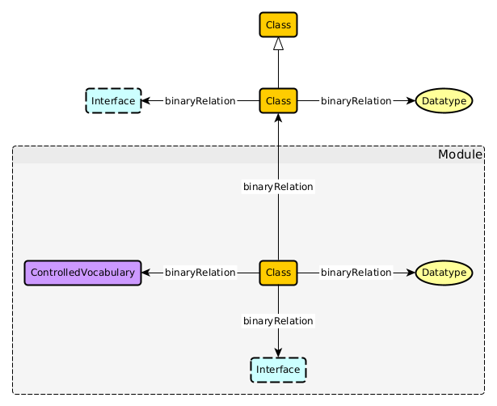

# Name of the Knowledge Graph
**Authors:** authors/contributors alphabetized.

## Use Case Scenario
### Narrative 
Adapted from `use-case.md`.

### Competency Questions
Adapted from `use-case.md`.

### Integrated Datasets
Adapted from `use-case.md`.

### References
Adapted from `use-case.md`.

## Modules
<!-- There should be one module section per module (essentially per key-notion) -->
### Module X
**Source Pattern:** name of adapted source pattern
**Source Data:** name(s) of dataset(s) which populate this module

#### Description
Description Text (adapted from the rationale in `key-notions.md`).

#### Axioms
* `axiom in manchester syntax`  
natural language description
* `axiom in manchester syntax`  
natural language description

#### Remarks
* Any remarks re: usage

## The Overall Knowledge Graph
### Namespaces
* prefix: namespace
* prefix: namespace

### Schema Diagram

### Axioms
* `axiom in manchester syntax`  
natural language description
* `axiom in manchester syntax`  
natural language description

### Usage
Adapted from `validation.md`, i.e., the competency questions + SPARQL queries.